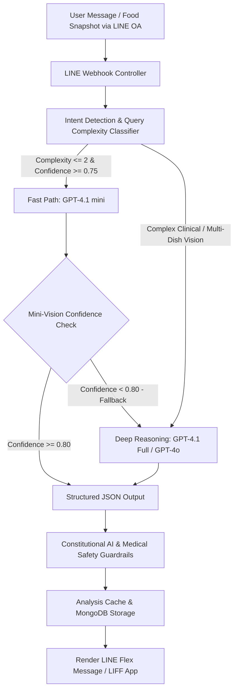

<p align="center">
  <a href="https://nestjs.com/" target="blank"></a>
</p>

<h1 align="center">KinGeng AI (กินเก่ง)</h1>
<h3 align="center">AI Nutritionist via LINE Official Account & LIFF Web Platform</h3>

<p align="center">
  <strong>An Production-Grade, Microservices-Ready Backend & Multimodal Health Assistant</strong><br />
  Engineered with NestJS, Azure OpenAI (GPT-4.1 / GPT-4o), Azure AI Vision, MongoDB & LINE Messaging API.
</p>

<p align="center">
  <a href="https://github.com/atipongsena/-Line-AInutritionist-nestjs-backend/actions"></a>
  <a href="https://nestjs.com/"></a>
  <a href="https://www.typescriptlang.org/"></a>
  <a href="https://azure.microsoft.com/en-us/products/ai-services/openai-service"></a>
  <a href="https://www.mongodb.com/"></a>
  <a href="https://developers.line.biz/"></a>
  <a href="https://pnpm.io/"></a>
  <a href="#-academic-credentials--contributors"></a>
</p>

<p align="center">
  <a href="#-executive-overview">Executive Overview</a> •
  <a href="#-key-features">Key Features</a> •
  <a href="#-hybrid-efficient-constitutional-ai-engine">Hybrid AI Engine</a> •
  <a href="#-system-architecture">System Architecture</a> •
  <a href="#-empirical-evaluation--benchmarks">Evaluation & Benchmarks</a> •
  <a href="#-quick-start">Quick Start</a> •
  <a href="#-environment-variables">Configuration</a> •
  <a href="#-academic-credentials--contributors">Contributors</a>
</p>

---

## 🌟 Executive Overview

In modern society, unbalanced dietary consumption and sedentary lifestyles pose urgent public health challenges—**over 42% of Thai adults face obesity risks**, and more than **25% suffer from undetected nutritional deficiencies** resulting from poor dietary literacy and lack of intuitive tracking tools.

**KinGeng AI (กินเก่ง)** is an intelligent, full-stack conversational nutrition platform natively integrated into **LINE Official Account (LINE OA)** and **LINE Front-end Framework (LIFF)**. Built upon a **Hybrid Efficient Constitutional AI** pipeline, KinGeng leverages multimodal computer vision and natural language processing to enable zero-friction meal logging, real-time macronutrient and micronutrient estimation, automated BMR/TDEE tracking, and medically sound dietary advisories.

---

## 🚀 Key Features

### 📸 1. Multimodal Food Vision & NLP Analysis
- **Image Recognition**: Accurate classification of Thai local dishes (*89.2% accuracy*) and international cuisine (*85.7% accuracy*) from food snapshots.
- **Portion & Nutrient Estimation**: Estimates serving weights, breakdown of primary ingredients, and calculates exact calories and nutrients.
- **Text & Voice Food Extraction**: Intelligently parses conversational Thai meal logs (e.g., *"ข้าวมันไก่พิเศษหนัง 1 จาน กับน้ำเก๊กฮวยหวานน้อย"*) into structured data models.
- **Non-Food Image Filter**: Pre-filters non-food pictures (pets, selfies, landscapes, general objects) to prevent false analyses and conserve compute tokens.

<p align="center">
  
  
  
</p>

---

### 💬 2. Smart Conversation & Contextual History
- **Multi-Turn Dialogue**: Remembers conversational context for subsequent inquiries (e.g., *"How much protein do I have left today?"*).
- **Intent Recognition**: Accurately detects user intents (*92.8% accuracy*) whether logging food, querying nutrition stats, or seeking meal recommendations.
- **Automated Meal Categorization**: Distributes logs automatically into Breakfast, Lunch, Dinner, and Snacks.
- **Command Prefix Filtering**: Ignores bot commands (e.g., messages starting with `/`) from LLM processing to eliminate token wastage.

<p align="center">
  
  &nbsp;&nbsp;&nbsp;&nbsp;
  
</p>

---

### 🎯 3. Personalized Health Profiles & Goal Tracking
- **Automatic BMR & TDEE Calculation**: Implements the validated *Harris-Benedict* formulation using user age, gender, height, weight, and activity level.
- **Specialized Dietary Regimens**: Full support for **Ketogenic (KETO)**, **Intermittent Fasting (IF 16/8, 5:2)**, **Low-Carb**, **Paleo**, **Vegetarian/Vegan**, and **Mediterranean** diets.
- **Health Conditions & Allergen Screening**: Enforces safety constraints for medical conditions (diabetes, hypertension, gout, CKD) and filters 10+ allergens (peanuts, seafood, lactose, etc.).
- **Interactive LIFF App**: Embedded full-screen Next.js dashboard for managing biometric profiles and visualizing caloric/nutrient balances.

<p align="center">
  
  
  
</p>

---

### 📊 4. Nutrition Analytics & Visual Reports
- **Daily Macro Breakdown**: Real-time progress bars and donut charts comparing intake vs. target (Calories, Protein, Carbs, Fats).
- **Weekly & Monthly Trajectories**: Visual trend analytics identifying eating patterns, skipped meals, and macro consistency.
- **Micronutrient Health Advisories**: Evaluates sodium, added sugar, saturated fats, fiber, vitamins, and minerals against Thai RDI (% Recommended Daily Intake).

<p align="center">
  
</p>

---

## 🧠 Hybrid Efficient Constitutional AI Engine

To balance real-time response latency, strict medical safety, and cost efficiency, KinGeng AI introduces a **Hybrid Constitutional AI Architecture**:

<p align="center">
  
</p>



### Core Innovations:
1. **Intelligent Query Complexity Classifier (Levels 1–4)**: Analyzes lexical markers, sentence structure, user biometric profile, and context length to determine optimal compute allocation.
2. **Dual-Tier Model Routing**:
   - **GPT-4.1 mini**: Serves ~97.8% of daily queries with low latency (~2.8s) and minimal token consumption.
   - **GPT-4.1 Full / GPT-4o**: Invoked conditionally for complex clinical edge cases or multi-dish image ambiguity.
   - **~90% AI Cost Reduction** compared to single-model large LLM implementations.
3. **Structured Outputs (`json_schema`) & Function Calling**: Guarantees deterministic JSON contracts for downstream UI rendering, completely eliminating parsing hallucination.
4. **Constitutional Medical Guidelines**: Pre-configured safety rules ensuring neutral, evidence-based recommendations, mandatory physician disclaimers, and safe dietary boundaries.

---

## 🏗️ System Architecture & Deployment

KinGeng AI is designed with clean modular architecture and deployed across **Microsoft Azure Cloud** infrastructure:

<p align="center">
  
</p>

<p align="center">
  
</p>

### Execution Sequence Flow:
<p align="center">
  
</p>

---

## 📊 Empirical Evaluation & Benchmarks

Validated through extensive senior project laboratory experiments and a 42-participant user acceptance study:

| Evaluation Benchmark | Result | Reference Standard / Target |
| :--- | :---: | :---: |
| **Thai Food Classification Accuracy** | **89.2%** | Standard Food-101 Baseline |
| **International Food Classification Accuracy** | **85.7%** | Standard Food-101 Baseline |
| **User Intent Recognition Accuracy** | **92.8%** | Conversational NLP Benchmark |
| **Nutritional Calculation Accuracy** | **97.2%** | Thai Dept. of Medical Sciences DB |
| **Image Analysis Response Latency** | **3.2s** | SLA Target: $\le$ 5.0s |
| **NLP Text Query Latency** | **1.8s** | SLA Target: $\le$ 3.0s |
| **Database Retrieval Latency** | **0.6s** | SLA Target: $\le$ 1.0s |
| **Operational AI Cost Reduction** | **~90%** | vs. Pure Large Model Architecture |
| **Continuous 24-Hour System Uptime** | **100%** | Zero Memory Leaks (MTTR 217ms) |
| **Alpha User Satisfaction Score** | **4.48 / 5.00** | Likert Scale ($n=42$) |

---

## 🛠️ Tech Stack

- **Backend Framework**: [NestJS 11](https://nestjs.com/) (Node.js 24 LTS, TypeScript 5.8)
- **Database & Storage**: [MongoDB 6.x](https://www.mongodb.com/) / [Azure Cosmos DB](https://azure.microsoft.com/en-us/products/cosmos-db) via [Mongoose 8.x](https://mongoosejs.com/), [Azure Blob Storage](https://azure.microsoft.com/en-us/products/storage/blobs)
- **AI & Vision Services**: [Azure OpenAI Service](https://azure.microsoft.com/en-us/products/ai-services/openai-service) (GPT-4.1 / GPT-4o), [Azure AI Vision](https://azure.microsoft.com/en-us/products/ai-services/ai-vision)
- **Frontend / LIFF App**: [Next.js](https://nextjs.org/) (App Router), React, Tailwind CSS, TypeScript
- **Messaging Ecosystem**: [LINE Messaging API SDK](https://developers.line.biz/), LINE Front-end Framework (LIFF)
- **Security & Infrastructure**: Docker, Azure Container Apps, GitHub Actions CI/CD, Passport JWT, AES-256 Encryption

---

## 📁 Repository Structure

```
ai-nutritionist-nestjs-backend/
├── packages/
│   └── shared-types/             # Monorepo shared TypeScript types & DTOs
├── liff-nutrition-next/          # Frontend Next.js LIFF Web Application
│   ├── src/app/                  # Next.js App Router pages (Dashboard, Profile, History)
│   └── src/components/           # Charts, Forms, and UI components
├── src/                          # NestJS Backend Application
│   ├── ai/                       # Hybrid AI model selector, prompts, and caching
│   ├── analysis-cache/           # In-memory & Redis caching layer
│   ├── common/                   # Global filters, interceptors, and guards
│   ├── conversation-history/     # Contextual chat memory and token managers
│   ├── food-item/                # Food database catalog and search
│   ├── food-log/                 # User meal logging and nutritional aggregations
│   ├── foods/                    # Reference food dataset and nutrition dictionaries
│   ├── image/                    # Image upload, preprocessing, and Azure Blob storage
│   ├── line/                     # LINE Webhook handlers and Flex Message templates
│   ├── nutrition/                # BMR/TDEE engine and macronutrient distributions
│   ├── openai/                   # Azure OpenAI Service client and structured output adapters
│   ├── schemas/                  # Mongoose ODM schemas (User, FoodLog, Goals)
│   ├── tasks/                    # Scheduled cron jobs and maintenance tasks
│   ├── user/                     # User biometric profile and dietary preferences
│   ├── app.module.ts             # Root application module
│   └── main.ts                   # Entry point, CORS configuration, and validation
├── Dockerfile                    # Multi-stage production container image
├── docker-compose.yml            # Local container development environment
├── package.json                  # Dependencies and root execution scripts
└── pnpm-workspace.yaml           # PNPM monorepo workspace configuration
```

---

## ⚡ Quick Start

### Prerequisites
- [Node.js](https://nodejs.org/) `>= 24.0.0`
- [pnpm](https://pnpm.io/) `>= 9.0.0`
- [MongoDB](https://www.mongodb.com/) (Local instance or MongoDB Atlas URI)
- Azure Subscription (Azure OpenAI & Azure Storage Blob)
- [LINE Developers Account](https://developers.line.biz/) (Messaging API Channel)

### 1. Clone & Install

```bash
# Clone the repository
git clone https://github.com/atipongsena/-Line-AInutritionist-nestjs-backend.git
cd -Line-AInutritionist-nestjs-backend

# Install monorepo dependencies
pnpm install
```

### 2. Configure Environment Variables

```bash
# Copy backend template
cp .env.example .env

# Copy frontend LIFF template (if running frontend)
cp liff-nutrition-next/.env.local.example liff-nutrition-next/.env.local
```

### 3. Run Backend Server

```bash
# Development mode with hot-reload
pnpm run start:dev

# Production build and execution
pnpm run build
pnpm run start:prod
```
The backend will be available at `http://localhost:3001` (or your configured `PORT`).

### 4. Run LIFF Frontend (Optional)

```bash
cd liff-nutrition-next
pnpm dev
```
The LIFF application will run on `http://localhost:3000`.

---

## ⚙️ Environment Variables

Configure the following parameters in your root `.env`:

```ini
# =============================================================================
# 🖥️ Server Configuration
# =============================================================================
NODE_ENV=development
PORT=3001
FRONTEND_URL=http://localhost:3000

# =============================================================================
# 🗄️ Database Configuration (MongoDB / Azure Cosmos DB)
# =============================================================================
DATABASE_URL=mongodb://localhost:27017/ai_food
# For MongoDB Atlas:
# DATABASE_URL=mongodb+srv://<user>:<password>@cluster.mongodb.net/ai_food

# =============================================================================
# 📱 LINE Messaging API Configuration
# =============================================================================
LINE_CHANNEL_ACCESS_TOKEN="YOUR_LINE_CHANNEL_ACCESS_TOKEN"
LINE_CHANNEL_SECRET="YOUR_LINE_CHANNEL_SECRET"

# =============================================================================
# 🤖 Azure OpenAI Configuration
# =============================================================================
AZURE_OPENAI_ENDPOINT="https://<your-resource-name>.openai.azure.com/"
AZURE_OPENAI_DEPLOYMENT_NAME_GPT4_1="gpt-4-deployment-name"
AZURE_OPENAI_DEPLOYMENT_NAME_GPT4_1_MINI="gpt-4-mini-deployment-name"
AZURE_OPENAI_API_VERSION="2024-04-01-preview"
AZURE_OPENAI_EMBEDDING_API_VERSION="2023-05-15"
AZURE_OPENAI_EMBEDDING_DEPLOYMENT_NAME="text-embedding-ada-002"

# =============================================================================
# 🔐 Azure Service Principal Credentials (Entra ID)
# =============================================================================
AZURE_CLIENT_ID="your-azure-ad-app-client-id"
AZURE_TENANT_ID="your-azure-ad-tenant-id"
AZURE_CLIENT_SECRET="your-azure-ad-app-client-secret"

# =============================================================================
# 💾 Azure Blob Storage (Food Images)
# =============================================================================
AZURE_STORAGE_CONNECTION_STRING="DefaultEndpointsProtocol=https;AccountName=...;AccountKey=...;EndpointSuffix=core.windows.net"
AZURE_STORAGE_CONTAINER_NAME="food-images"

# =============================================================================
# 🔑 Security & Performance
# =============================================================================
JWT_SECRET="your-secure-jwt-secret-key"
CACHE_TTL="3600"
REQUEST_TIMEOUT="30000"
MAX_FILE_SIZE="10485760"
```

---

## ↔️ LINE Webhook Integration

1. Expose your local port via HTTPS tunnel (e.g. using [ngrok](https://ngrok.com/)):
   ```bash
   ngrok http 3001
   ```
2. Navigate to **LINE Developers Console** > Your Channel > **Messaging API**.
3. Set the **Webhook URL** to:
   ```
   https://<your-ngrok-domain>.ngrok-free.app/line/webhook
   ```
4. Enable **"Use Webhook"** and test via the **"Verify"** button.

---

## 🧪 Testing Suite

```bash
# Run unit tests
pnpm run test

# Run tests with watch mode
pnpm run test:watch

# Generate code coverage
pnpm run test:cov

# Run End-to-End (e2e) tests
pnpm run test:e2e
```

---

## 🚀 Deployment

The backend is configured for cloud container deployment on **Azure Container Apps** and static frontend hosting on **Vercel** / **Azure Static Web Apps**:

```bash
# Build Docker image
docker build -t <acr-name>.azurecr.io/ai-nutritionist-backend:latest .

# Push image to Azure Container Registry
docker push <acr-name>.azurecr.io/ai-nutritionist-backend:latest
```

📖 **Deployment Reference Docs:**
- [Azure Deployment Guide](./AZURE_DEPLOYMENT_GUIDE.md)
- [General Deployment Guide](./DEPLOYMENT_GUIDE.md)
- [Deployment Troubleshooting](./DEPLOYMENT_TROUBLESHOOTING.md)
- [Production Quick Reference](./PRODUCTION_DEPLOY_QUICK_REF.md)


## 📄 License & Disclaimer

- **License**: This project is developed under academic licensing for Bangkok University.
- **Medical Disclaimer**: *KinGeng AI provides nutritional estimates and dietary suggestions for general wellness and educational purposes only. It is not intended as a substitute for professional clinical medical advice, diagnosis, or treatment.*

<p align="center">
  Built with ❤️ by the KinGeng AI Team
</p>
